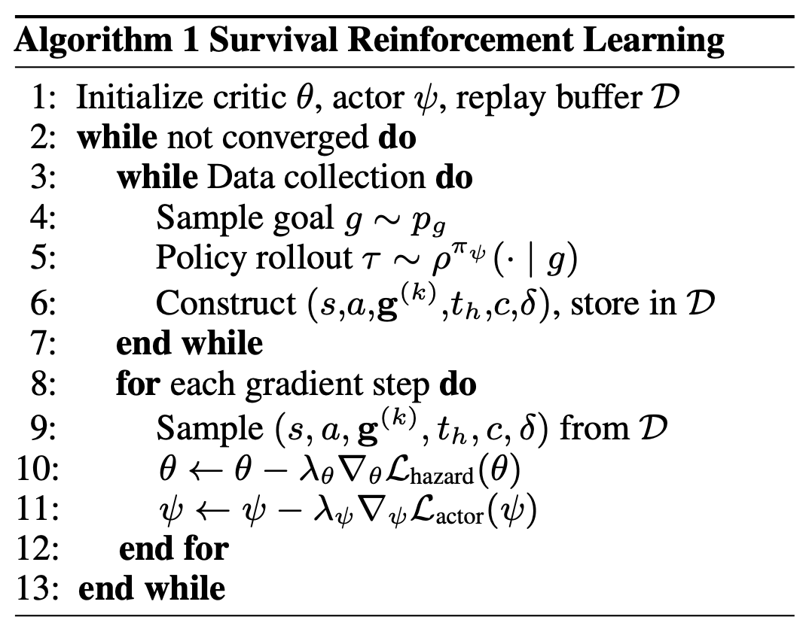

</img>

## Survival RL (wip)

Explorations into an application of [survival analysis to RL](https://arxiv.org/abs/2605.31273), proposed by Tiofack et al. earlier this year

## Install

```bash
$ pip install survival-rl
```

## Usage

`HazardCritic` takes a batch of states, actions and events, and predicts for each state-action pair the time bin in which the event is first dwelled upon, conditioned on that event. It is trained by maximum likelihood on the predicted logits, where `reach_event_index` marks the observed time bin, and `-1` (or anything at or past `horizon_cutoff`) is treated as right censored.

```python
import torch
from survival_rl import HazardCritic

critic = HazardCritic(
    dim = 64,
    depth = 2,
    dim_state = 8,
    num_actions = 3,
    pred_time_bins = 32
)

state  = torch.randn(16, 8)
action = torch.randn(16, 3)
event  = torch.randn(16, 8)     # every state and action is conditioned on the event

reach_event_index = torch.randint(0, 32, (16,))
horizon_cutoff    = torch.full((16,), 32)

loss = critic(state, action, event, reach_event_index = reach_event_index, horizon_cutoff = horizon_cutoff)
loss.backward()
```

Once trained, a policy can be extracted for reaching the event, or avoiding it with `negate = True`, given any actor of the form `(state, event) -> action`.

```python
class Actor(torch.nn.Module):
    def __init__(self, dim_state = 8, dim_event = 8, num_actions = 3):
        super().__init__()
        self.net = torch.nn.Sequential(
            torch.nn.Linear(dim_state + dim_event, 64),
            torch.nn.SiLU(),
            torch.nn.Linear(64, num_actions)
        )

    def forward(self, state, event):
        return self.net(torch.cat((state, event), dim = -1))

actor = Actor()

# maximize the value to reach the event

loss = -critic.extract_policy(actor, state, event).mean()
loss.backward()

# or pass `negate = True` to avoid the event instead

loss = -critic.extract_policy(actor, state, event, negate = True).mean()
loss.backward()
```

The reach indices for training are computed from any trajectory data with `compute_first_dwell_time`, which finds the first time each trajectory dwells within `eps` of its event.

```python
import torch
from survival_rl import compute_first_dwell_time

states = torch.randn(4, 64, 8)      # (batch, time, dim)
event  = states[:, -1:]             # (batch, num_queries, dim)

# first dwell of each trajectory at its event - -1 means it was never reached,
# and is right censored at `horizon_cutoff`

reach_event_index, horizon_cutoff = compute_first_dwell_time(event, states = states, eps = 0.25)
```

For a variant where the time bins compete for a single unit of mass through a softmax, use `HazardCriticCompetitive` in place of `HazardCritic`.

## Citations

```bibtex
@inproceedings{Tiofack2026SVL,
    title     = {SVL: Goal-Conditioned Reinforcement Learning as Survival Learning},
    author    = {Franki Nguimatsia Tiofack and Fabian Schramm and Th{\'e}otime Le Hellard and Justin Carpentier},
    booktitle = {International Conference on Machine Learning (ICML)},
    year      = {2026},
    url       = {https://arxiv.org/abs/2604.17551}
}
```

```bibtex
@article{Tiofack2026SRL,
    title   = {Survival Reinforcement Learning: Toward Scalable Self-Supervised RL},
    author  = {Franki Nguimatsia-Tiofack and Fabian Schramm and Th{\'e}otime Le Hellard and Justin Carpentier},
    journal = {arXiv preprint arXiv:2605.31273},
    year    = {2026},
    note    = {19th European Workshop on Reinforcement Learning (EWRL), Oral},
    url     = {https://arxiv.org/abs/2605.31273}
}
```
